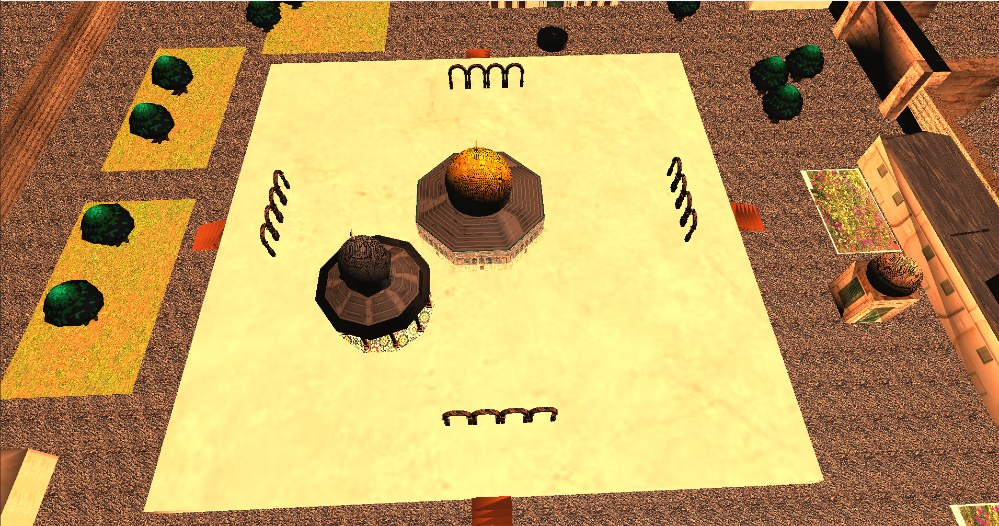
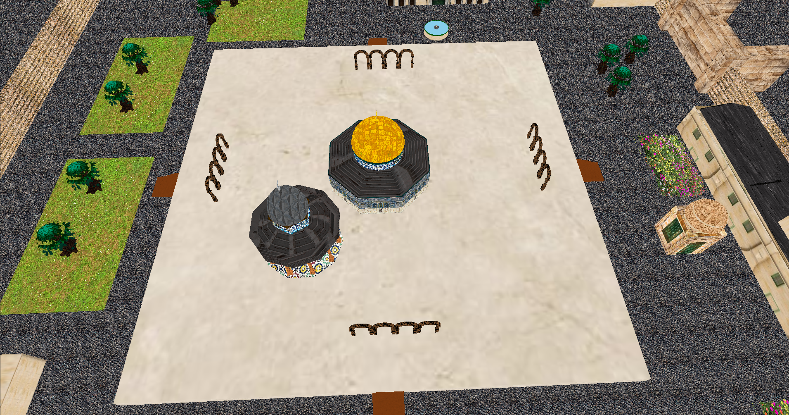
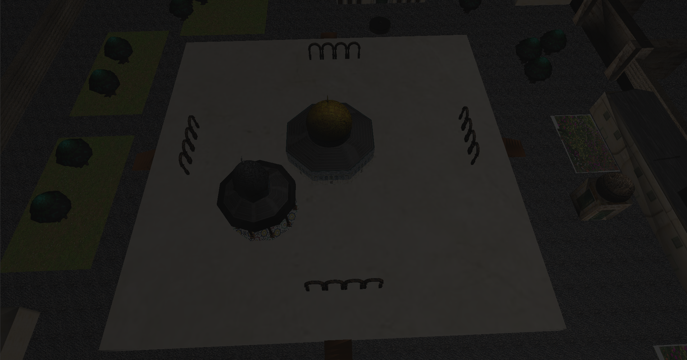
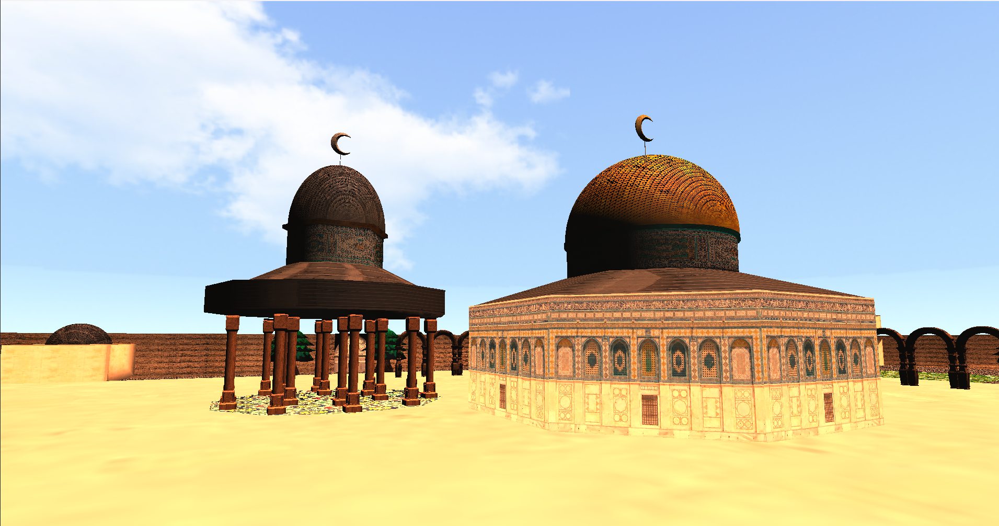
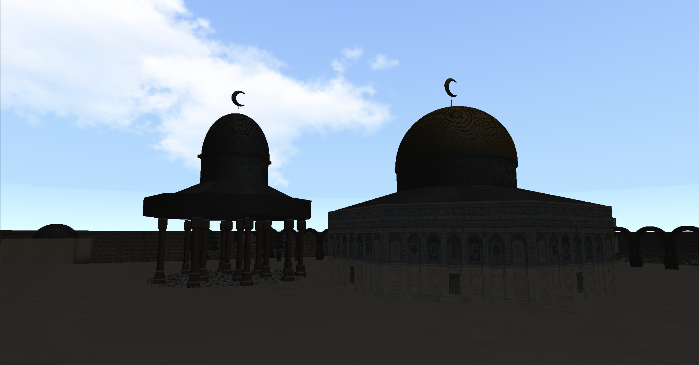
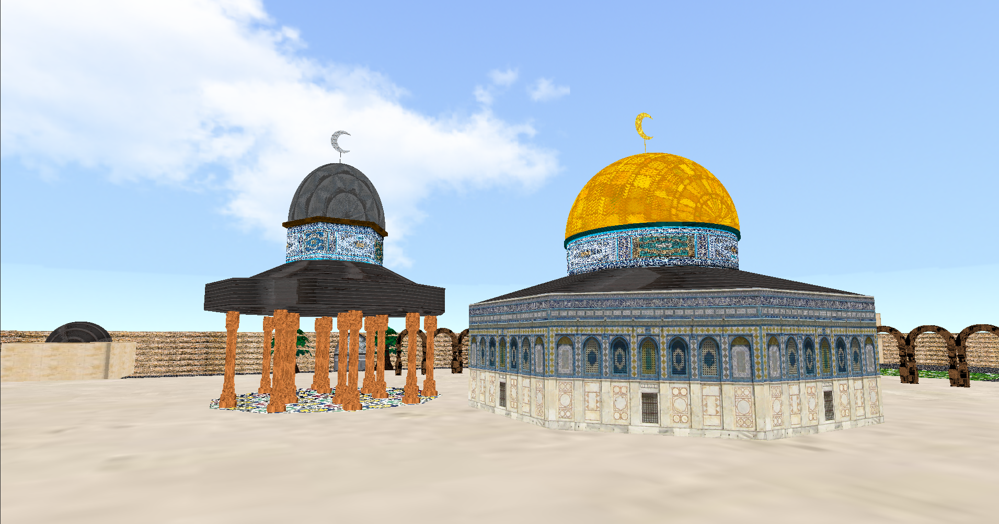
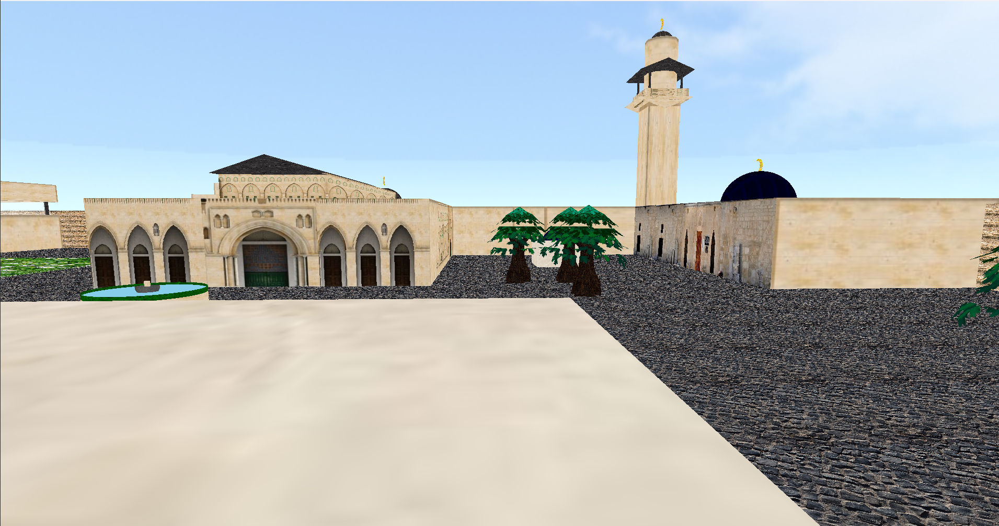
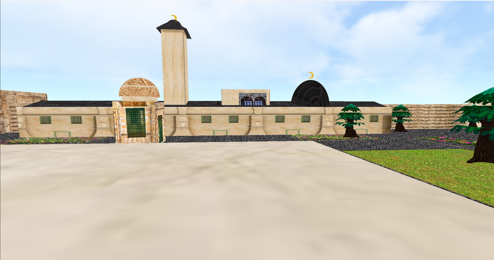

# Al Aqsa Mosque Simulation 

This project is a simulation of the Al Aqsa Mosque using C++ and modern OpenGL. It aims to provide a realistic virtual experience of the mosque, allowing users to explore and interact with its various elements

## Table of Contents
- Features
- Requirements
- Usage
- Controls
- Contributing
- License
## Features
- Detailed and accurate representation of the Al Aqsa Mosque.
- Realistic lighting and shading effects using modern OpenGL techniques.
- Interactive navigation and exploration of the mosque.
- Support for different viewing modes (e.g., day/night).
- Enhanced user experience with intuitive controls.
- High-quality textures and models.
## RequirementsTo run this simulation project,
 you need to have the following software and libraries installed on your system:
 - C++ compiler (supporting C++11 or higher)
 - Modern OpenGL (supporting OpenGl 3.3 )
 - SFML library
 - GLEW library
 - GLM library
 - Assimp library
 ## Installation1.
- Clone this repository to your local machine using the following command:
        ```1.git clone https://github.com/tarook0/Al-Aqsa.git```
        ```2. Navigate to the project directory:cd Al Aqsa.```
        ```3. Build the project using  build system (meson), ensuring that all required libraries are linked correctly.```
## UsageOnce the project is successfully built,
- follow these steps to run the simulation:
        ```1. Open a terminal or command prompt.```
        ```2. Navigate to the project directory:cd Al Aqsa```
        ```3. Execute the compiled binary file: ./mosque_simulation ```
        ```4. The simulation window should open, displaying the Al Aqsa Mosque environment.```
## ControlsThe simulation
 provides the following controls for navigating and interacting with the mosque:
 - Mouse Movement: Move the mouse to look around in different directions.
 - W/A/S/D: Move forward, left, backward, and right, respectively.
 - J: Toggle lighting mode (day/night).
 - K: Toggle lighting mode (day).
 - L: Toggle lighting mode (Of).
 - CTRl : Move Downward.
 - Left_shift : Move Upward.
 - Esc: Exit the simulation.

 ## ContributingContributions
  to this project are welcome. 
  If you find any issues or have suggestions for improvements, please open an issue or submit a pull request on the GitHub repository. Make sure to follow the repository's code of conduct.When contributing, please provide detailed information about the changes you made and any relevant screenshots or recordings demonstrating the enhancements.

### [Simulation Video Link Demo ](https://youtu.be/mQgjuTec9U8)

## Screenshots

### Sections












## Assets

### 3D Models
- [Multi_Column](https://sketchfab.com/3d-models/palace-arch-with-decorative-columns-ce1a2d2f7df94c9baf72b7cc1a1c1eea)
- [Column](https://free3d.com/3d-model/beautiful-column-68523.html)
- [Tree](https://opengameart.org/content/tree-stylized-toon)
- [CrescentMoon](https://sketchfab.com/3d-models/moon-knights-boomerang-low-poly-f70c7ef4677849fcad5c773f17c1cb35)
- [CHANDELIER](https://free3d.com/3d-model/modul_chandelier-347192.html)

- 

### Music
- [Azan](https://youtu.be/BjpzcLsJeBs)

## Special Thanks
We would like to express our special thanks to the following project:
- [AntWare](https://github.com/YamanQD/AntWare.git):

- and thats everything
- 
